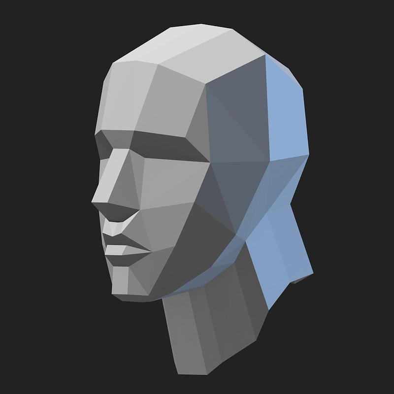
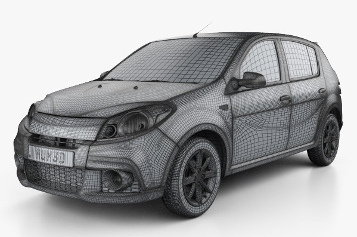

# 3D Mesh Generation

This project offers tools and utilities to generate and manipulate 3D meshes using Python.




## Table of Contents

- [Features](#features)
- [Installation](#installation)
- [Usage](#usage)
- [Dependencies](#dependencies)
- [Contributing](#contributing)
- [License](#license)

## Features

- Generate basic 3D mesh structures.
- Import and export in popular 3D formats (OBJ, STL).
- Visualization tools for quick mesh inspection.
- Manipulation utilities for scaling, translating, and rotating meshes.

## Installation

1. Clone the repository:
```bash
git clone https://github.com/priteshraj10/3Dmesh.git
```
2. Navigate to the project directory:
```bash
cd 3DMeshPython
```
3. Install the required dependencies:
```bash
pip install -r requirements.txt
```
## Usage
Here's a quick start example:
```bash
from meshgen import Mesh3D

# Initialize the mesh
mesh = Mesh3D()

# Generate a simple cube mesh
mesh.generate_cube(size=2.0)

# Visualize the mesh
mesh.visualize()
```

## More advanced usage:
```bash
# Import a mesh from an OBJ file
mesh.import_obj("path/to/your.obj")

# Translate and scale the mesh
mesh.translate(dx=1, dy=0, dz=0)
mesh.scale(sx=1.5, sy=1.5, sz=1.5)

# Export the modified mesh
mesh.export_obj("path/to/save.obj")
```

## Dependencies
* numpy
* matplotlib
* py3Dmol

Ensure you have the above dependencies installed, or simply run pip install -r requirements.txt.

## Contributing
We welcome contributions to the project. Before contributing, please review our contribution guidelines.

## License
This project is licensed under the MIT License. See LICENSE for more details.

---

Remember to adjust the code snippets and other details to match the specifics and functionality of your 3D mesh generation library.
